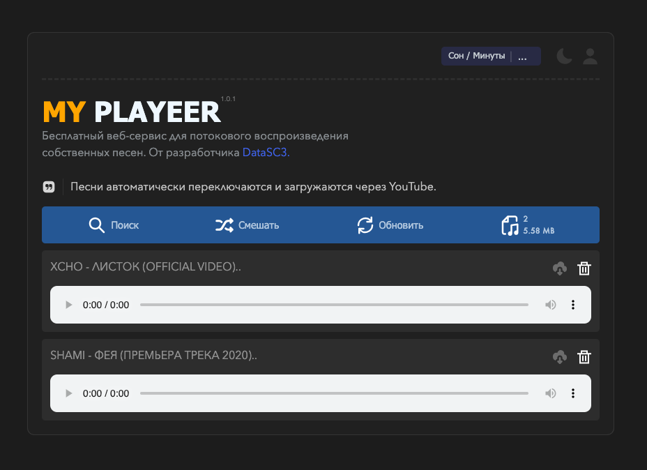

<meta property="og:title" content="web-player">
<meta property="og:description" content="Бесплатный веб-сервис для потокового воспроизведения собственных и сторонних песен, ПОДДЕРЖИВАЕТ YOUTUBE. От разработчика DataSC3.">
<meta property="og:image" content="src/git-resurces/banner.png">
<meta name="author" content="FELIX4">
<meta name="keywords" content="Python web-player - Бесплатный веб-плеер.">


# 🔥 WEB-PLAYER - Беспланый веб-плеер! v: 1.0.1 🔥





## 💻 ПК ВЕРСИЯ:
[ПК Версия](https://github.com/DataSC3/web-player/blob/main/src/git-resurces/pc-version.mp4)
<video width="640" height="480" controls>
  <source src="https://github.com/DataSC3/web-player/blob/main/src/git-resurces/pc-version.mp4" type="video/mp4">
  Ваш браузер не поддерживает встроенные видео.
</video>

## 📱 МОБИЛЬНАЯ ВЕРСИЯ:
[Мобильная Версия](src/git-resources/mobile-version.mp4)
<video width="320" height="240" controls>
  <source src="src/git-resources/mobile-version.mp4" type="video/mp4">
  Ваш браузер не поддерживает видео.
</video>

## 🚀 ЗАПУСК
[Запуск](src/git-resources/start.mp4)
<video width="320" height="240" controls>
  <source src="src/git-resources/start.mp4" type="video/mp4">
  Ваш браузер не поддерживает видео.
</video>

## 💬 ЛОГИРОВАНИЕ
[Логирование](https://vimeo.com/1006036396?share=copy)
<video width="320" height="240" controls>
  <source src="src/git-resources/logging.mp4" type="video/mp4">
  Ваш браузер не поддерживает видео.
</video>


### **🔖 Функционал плеера:**
    * Автоматическое переключение треков;
    * Удаление треков;
    * Перемешка треков;
    * Импорт через YouTube (скачивание);
    * Информация о треках;
    * Таймер сна;

    * Идентификация трека:
    - Указывает откуда воспроизводится трек, через локальное хранилище или трек скаченный через YouTube.

    * Создание и использование аккаунтов:
    - При вводе какого-либо имени аккаунта, сервер найдет эту дирректорию. Если не найдет то создаст его по указанному пути (MUSIC_PATH).

    * Логирование в консоль:
    - При включении логирования, сервер будет писать в консоль о каждом своем шаге.

    —— 2024.09.02

### **🌟 В будущем будет:**
    * Темная / Светлая тема.
    
    —— FUTURE

### **💼 Правообладатель:**
    * Разработчик: FELIX4
    * Канал: noblack_channel

    —— TELEGRAM


---
## УСТАНОВКА 📥
## **📱 Termux:**
```Bash
1. pkg update -y && upgrade -y
2. pkg install git -y python3 -y
3. pkg install python3-pip
4. git clone https://github.com/DataSC3/web-player.git
5. cd web-player
6. python3 setup.py
7. НАСТРАИВАЕМ ФАЙЛ src/config.py ЗАТЕМ ЗАПУСКАЕМ
8. python3 start.py
```

##### ИЛИ МОЖЕТЕ СКОПИРОВАТЬ ЭТО, И ВСТАВИТЬ. 
```Bash
pkg update -y && upgrade -y && pkg install git -y python3 -y && pkg install python3-pip && git clone https://github.com/DataSC3/web-player.git && cd web-player && python3 setup.py && python3 start.py
```


---
## **💻 Linux:**
```Bash
1. sudo apt-get install git 
2. sudo apt-get install python3
4. git clone https://github.com/DataSC3/web-player.git
5. cd web-player
6. python3 setup.py
7. НАСТРАИВАЕМ ФАЙЛ src/config.py ЗАТЕМ ЗАПУСКАЕМ
8. python3 start.py
```

##### ИЛИ МОЖЕТЕ СКОПИРОВАТЬ ЭТО, И ВСТАВИТЬ. 
```Bash
sudo apt-get install git && sudo apt-get install python3 && git clone https://github.com/DataSC3/web-player.git && cd web-player && python3 setup.py && python3 start.py
```


---
## **🌀 Debian:**
```Bash
1. sudo apt-get install git 
2. sudo apt-get install python3
3. git clone https://github.com/DataSC3/web-player.git
4. cd web-player
5. python3 setup.py
6. НАСТРАИВАЕМ ФАЙЛ src/config.py ЗАТЕМ ЗАПУСКАЕМ
7. python3 start.py
```

##### ИЛИ МОЖЕТЕ СКОПИРОВАТЬ ЭТО, И ВСТАВИТЬ. 
```Bash
sudo apt-get install git && sudo apt-get install python3 && git clone https://github.com/DataSC3/web-player.git && cd web-player && python3 setup.py && python3 start.py
```


---
## **👾 Arch:**
```Bash
1. sudo pacman -Syu python git
2. git clone https://github.com/DataSC3/web-player.git
3. cd web-player
4. python3 setup.py
5. НАСТРАИВАЕМ ФАЙЛ src/config.py ЗАТЕМ ЗАПУСКАЕМ
6. python3 start.py
```

##### ИЛИ МОЖЕТЕ СКОПИРОВАТЬ ЭТО, И ВСТАВИТЬ.
```Bash
sudo pacman -Syu git python3 && git clone https://github.com/DataSC3/web-player.git && cd web-player && python3 setup.py && python3 start.py
```


---
## **🖥 Windows (cmd):**
- Установите Python3:\
[Скачать Python можно тут.](https://www.python.org/downloads/)  ВАЖНО: поставьте галочку **"Add to PATH"** при установке, после установки, откройте консоль и введите:

```Bash
1. cd web-player
2. python3 setup.py
3. НАСТРАИВАЕМ ФАЙЛ src/config.py ЗАТЕМ ЗАПУСКАЕМ
4. python3 start.py

```
---

## **⏳ Запуск:**
- Скачайте [репозиторий](https://github.com/DataSC3/web-player/archive/master.zip) и распакуйте в удобное место.


----
# ⚙️ НАСТРОЙКИ

### **📑 src/config.py:**
    * MUSIC_PATH = "путь к директории с треками (static/music/) по умолчанию";

    * HOST, PORT = "localhost", 9000 (Настройки сети (Хост, Порт)) по умолчанию;

    - Для подключения плеера к домену, важно указать HOST="вашДомен", PORT=80 или 443;
    
    * STATUS_COUNT_FILE = "Путь к файлу где сохраняються результаты установок треков через YouTube (src/.status_count.txt) по умолчанию";

    * STATUS_TEXT = "Текст для FRONTEND (class="status-text") (Песни автоматически переключаются и загружаются через YouTube.) по умолчанию";

    * STATUS_YT = "Текст для распознования песни что он загружен из YouTube для FRONTEND (-YT9) по умолчанию";

    - Заметье, без этих настроек сервис НЕ БУДЕТ РАБОТАТЬ должным образом.

### **📑 main.py:**
    * TOOLS = ToolsTrack(directory_path=MUSIC_PATH) (Работа с файловой системой);

    * YOUTUBE = YouTubeDL(directory_path=MUSIC_PATH) (Работа со сторонними модулям YouTube);

    * TEMP_VAR = "TEMP-VARIABLE" (ВРЕМЕННОЕ ХРАНИЛИЩЕ ВРЕМЕННЫХ ДАННЫХ (НЕ УДАЛЯТЬ | def search()));

    * app.run(host=HOST, port=PORT) (debug=True - Будет показывать ошибки прямо на сайте в релизах стоит отключить);

    - Для подключения сертификатов домена к плееру, важно указать certfile="сертификат.crt", keyfile="ключ.key";
    
    - Заметье, без этих настроек сервис НЕ БУДЕТ РАБОТАТЬ должным образом.

### **📑 src/tools.py:**
    * _get_playlist(self, link: str, rending_count: int = 5, rending_timeout: int = 60);

    - МОДУЛЬ ОТКЛЮЧЕН, рабочий | по ссылке плейлиста получает ссылки на все треки в плейлисте (HTMLSession());

    - Заметье, без этих настроек сервис НЕ БУДЕТ РАБОТАТЬ должным образом.

### **📑 templates/index.html:**
    * Доступны закоментированные блоки управления аудио-плеером (Переключение трека, вкл./выкл.)
    
### **💌 Особенности:**
    * Автовоспроизведение треков отключена, но в любой момент вы сможете ее включить через static/functions.js, но он играет маловажную роль ибо, 
    задействован авт. переключение треков и сама функция Автозагрузки была отключения из-за оптимизации, когда у вас будет более 500 треков.;

    * Красивый, удобный и минималестичный интерфейс с анимациями;

    * status-text показывает статус работы плеера, напр. когда что-то пошло не так или сколько треков установилось из плейлиста (с помощью self.STATUS_COUNT_FILE)

### **🚀 Как запустить?:**
* После устновки первым очередем, убедитесь что все модули уже установлены (запустите setup.py).

1. ```python3 setup.py```
2. ```python3 start.py```
(Рекомендуется)

ИЛИ 

3. ```python3 main.py```
